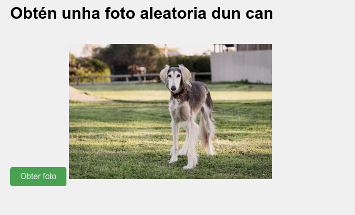
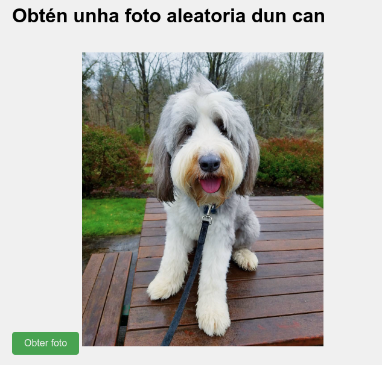

# Práctica: Desenvolvemento de unha aplicación para mostrar fotos aleatorias de cans

## Recordatorio
Recorda lanzar o proxecto con `php -S localhost:9090 `

## Obxectivo:
O obxectivo desta práctica é que desenvolvas a parte do ficheiro `app.js` dunha aplicación web que se conecta á API pública de The Dog API para mostrar unha foto aleatoria dun can cada vez que o usuario prema un botón.

## Descripción do funcionamento da aplicación:
- A aplicación debe ter un botón que, cando se prema, faga unha petición á API de **The Dog API** para obter unha foto aleatoria dun can.
- A foto debe ser mostrada na páxina web dentro dunha etiqueta ``.
- A aplicación debe manexar correctamente os erros, mostrando un mensaxe na consola se ocorre algún problema coa petición ou se non se consegue obter unha foto da API.

## Funcionalidades que debes implementar no ficheiro `app.js`:

1. **Obter a foto aleatoria dun can:**
   - Fai unha petición **GET** á API de The Dog API (https://thedogapi.com/) para obter unha foto aleatoria.
   - A URL que debes utilizar é: `https://api.thedogapi.com/v1/images/search?api_key=TÚA-CHAVE-API`. **Substitúe "TÚA-CHAVE-API" pola chave de API que consigas ao rexistrarte na páxina de The Dog API.**
   
2. **Manejar a resposta da API:**
   - A resposta da API será un array. Extrae a URL da foto do primeiro elemento deste array.
   - Modifica o atributo `src` da etiqueta `` para mostrar a foto no sitio correspondente da páxina.

3. **Manejar os erros:**
   - Se a petición á API falla ou se hai algún problema, captura os erros e mostra un mensaxe na consola con detalles sobre o erro.
   
4. **Interacción co usuario:**
   - Debes crear un evento que faga a petición cando o usuario prema o botón "Obter foto".
   - O botón debe chamar á función que faga a petición e actualice a imaxe cada vez que se prema.

## Recursos adicionais:
- Se non soubeses como obter a chave de API, podes rexistrarte gratuitamente en [The Dog API](https://thedogapi.com/).
- Utiliza o método `fetch` de JavaScript para facer as peticións asincrónicas.
- A resposta da API será un JSON, polo que necesitarás usar o método `.json()` para procesar os datos.

## Estructura básica de `app.js`:

O ficheiro `app.js` debe ter a seguinte estrutura:

1. Crear unha función chamada `fetchRandomDogImage()` que faga a petición á API.
2. Asegúrate de que a foto se amosa correctamente na páxina.
3. Asocia un evento ao botón para que, cando se prema, se chame á función `fetchRandomDogImage()`.

## Captura

