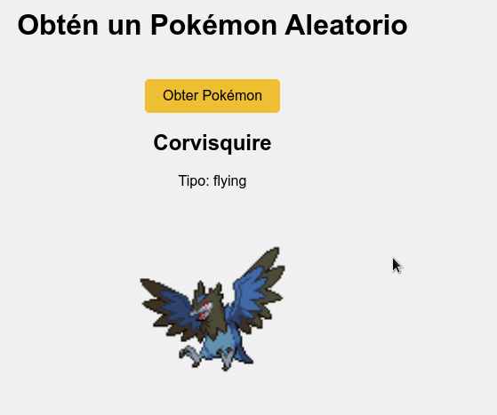
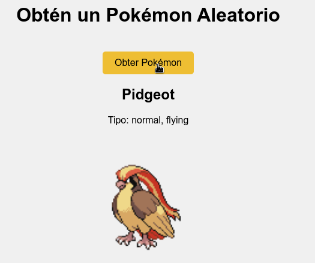

# Práctica: Desenvolvemento dunha aplicación para mostrar Pokémon aleatorios

## Obxectivo:
O obxectivo desta práctica é que desenvolvas a parte do ficheiro `app.js` dunha aplicación web que se conecta á API pública de **PokéAPI** para mostrar información sobre un Pokémon aleatorio cada vez que o usuario prema un botón.

## Descripción do funcionamento da aplicación:
A aplicación terá un botón que, cando se prema, fará unha petición á **PokéAPI** para obter un Pokémon aleatorio. A aplicación debe amosar o nome do Pokémon, o seu tipo e unha imaxe do Pokémon. A información deberá actualizarse cada vez que o usuario prema o botón.

## Funcionalidades que debes implementar no ficheiro `app.js`:

1. **Obter un Pokémon aleatorio:**
   - Fai unha petición **GET** á API de **PokéAPI** (https://pokeapi.co/) para obter un Pokémon aleatorio. A URL que debes utilizar é: `https://pokeapi.co/api/v2/pokemon/[ID]`.
   - **Nota importante:** Substitúe `[ID]` por un número aleatorio entre 1 e 898 (o número de Pokémon na PokéAPI). Debes obter este número aleatorio no código e engadilo á URL.

2. **Manejar a resposta da API:**
   - A resposta da API será un JSON. Debes extraer a información do nome do Pokémon, os tipos de Pokémon (por exemplo, "Fogo", "Auga") e a súa imaxe.
   - Modifica o DOM para mostrar o nome, os tipos e a imaxe do Pokémon na páxina.
   - O nome do Pokémon debe aparecer con a primeira letra en maiúscula.

3. **Manejar os erros:**
   - Se a petición á API falla (por exemplo, se o número aleatorio non existe), captura os erros e amosa un mensaxe de erro na consola indicando que houbo un problema ao obter o Pokémon.

4. **Interacción co usuario:**
   - Debes asociar un evento ao botón "Obter Pokémon" que, cando se prema, chame á función que fai a petición á API.
   - O botón debe actualizar a información do Pokémon na páxina cada vez que se prema.

## Recursos adicionais:
- A PokéAPI proporciona unha documentación completa [aquí](https://pokeapi.co/docs/v2) que che pode axudar a entender mellor como usar a API.
- A resposta da API está en formato JSON, polo que necesitarás usar o método `.json()` para procesar os datos.
- Usarás o método `fetch` de JavaScript para facer a petición asincrónica.

## Estructura básica do ficheiro `app.js`:

O ficheiro `app.js` debe ter a seguinte estrutura:

1. Crear unha función chamada `fetchRandomPokemon()` que faga a petición á API.
2. Asegúrate de que a información (nome, tipo e imaxe) se mostra correctamente na páxina.
3. Asocia un evento ao botón para que, cando o usuario prema no botón, se chame á función `fetchRandomPokemon()` e se actualice a información dun novo Pokémon.

## Capturas

