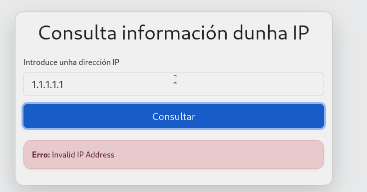
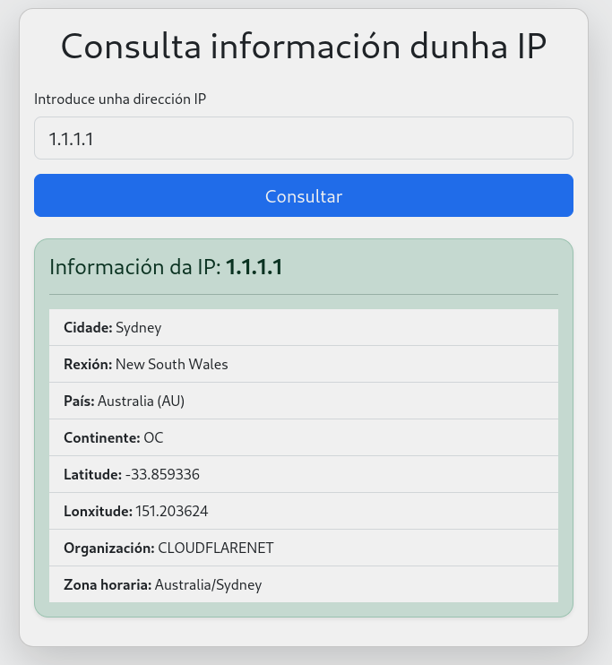

# 🧠 Exercicio: Consulta dunha IP coa API de ipapi usando JavaScript

## 🎯 Obxectivo

Completar a parte en JavaScript dunha páxina web que permite ao usuario introducir unha dirección IP e obter información sobre a súa localización, empregando a API pública de [ipapi](https://ipapi.co/).

A parte de HTML xa está preparada. O alumnado debe:
- Recoller os datos do formulario.
- Realizar unha petición `fetch` ao endpoint `https://ipapi.co/{ip}/json/`.
- Amosar os datos recibidos nun bloque `div` con `id="result"`.
- Xestionar posibles erros.

---

## 🧾 Instrucións

1. Completa o ficheiro `app.js` para que:
   - Intercepta o envío do formulario (evitando que recargue a páxina).
   - Recolla a IP introducida polo usuario.
   - Realice unha petición á API.
   - Amose a información obtida no elemento `<div id="result">...</div>`.

2. Emprega os métodos `fetch()`, `then()`, e `catch()` para tratar a resposta.

3. O resultado debe amosarse con formato HTML (xa se che dá a estrutura abaixo).

---

## 🧱 HTML proporcionado (non modificar)

```html
 <!DOCTYPE html>
<html lang="gl">
<head>
    <meta charset="UTF-8">
    <title>Consulta IP coa API de ipapi</title>
    <!-- Bootstrap CSS CDN -->
    <link href="https://cdn.jsdelivr.net/npm/bootstrap@5.3.3/dist/css/bootstrap.min.css" rel="stylesheet">
</head>
<body class="bg-light">
    <div class="container py-5">
        <div class="row justify-content-center">
            <div class="col-md-8 col-lg-6">
                <div class="card shadow-lg rounded-4">
                    <div class="card-body">
                        <h1 class="card-title text-center mb-4">Consulta información dunha IP</h1>
                        <form id="ipForm" class="mb-3">
                            <div class="mb-3">
                                <label for="ipInput" class="form-label">Introduce unha dirección IP</label>
                                <input type="text" class="form-control form-control-lg" id="ipInput" name="ip" placeholder="Exemplo: 8.8.8.8" required>
                            </div>
                            <div class="d-grid">
                                <button type="submit" class="btn btn-primary btn-lg">Consultar</button>
                            </div>
                        </form>
                        <div id="result"></div>
                    </div>
                </div>
            </div>
        </div>
    </div>
    <!-- Bootstrap JS CDN (opcional, para mellores interaccións) -->
    <script src="https://cdn.jsdelivr.net/npm/bootstrap@5.3.3/dist/js/bootstrap.bundle.min.js"></script>
    <!-- O teu ficheiro JS -->
    <script src="app.js"></script>
</body>
</html>


```


## ⚠️ Se ocorre un erro, debes mostrar o seguinte contido en #result:
```html
<div class="alert alert-danger mt-4">
    <strong>Erro:</strong> Mensaxe de erro aquí
</div>

```

## 🧩 Formato de saída (inserir en #result)
Unha vez feita a petición correctamente, mostrar no div#result algo como:
```html
<div class="alert alert-success mt-4">
    <h4 class="alert-heading">Información da IP: <span class="fw-bold">8.8.8.8</span></h4>
    <hr>
    <ul class="list-group list-group-flush">
        <li class="list-group-item"><strong>Cidade:</strong> Mountain View</li>
        <li class="list-group-item"><strong>Rexión:</strong> California</li>
        <li class="list-group-item"><strong>País:</strong> United States (US)</li>
        <li class="list-group-item"><strong>Continente:</strong> NA</li>
        <li class="list-group-item"><strong>Latitude:</strong> 37.386</li>
        <li class="list-group-item"><strong>Lonxitude:</strong> -122.0838</li>
        <li class="list-group-item"><strong>Organización:</strong> Google LLC</li>
        <li class="list-group-item"><strong>Zona horaria:</strong> America/Los_Angeles</li>
    </ul>
</div>

```
 

## 📌 Campos que deben aparecer no resultado
Usa os seguintes campos da resposta JSON:
- ip
- city
- region
- country_name
- country_code
- continent_code
- latitude
- longitude
- org
- timezone

## Pasos para implementar o JS.

Pasos para implementar o JS que consulta datos dunha IP coa API de ipapi
1. **Asociar o evento submit ao formulario**
   1. Busca o formulario polo seu ID (ipForm).
   2. Asocia unha función ao evento submit do formulario.
   3. Dentro desa función, emprega event.preventDefault() para evitar que a páxina se recargue ao premer o botón.

2. **Limpar resultados anteriores**. Antes de facer a consulta, borra o contido do div de resultados (result) para que non se amosen datos de buscas previas.
3. Recoller e validar a IP introducida
   1. Obten o valor do campo de entrada (ipInput), eliminando espazos ao principio ou final con trim().
   2. Se o campo está baleiro, chama á función mostrarErro() para avisar ao usuario e sae da función.
4. **Construír a URL da API**
   1. Crea a URL do endpoint empregando a IP introducida polo usuario: `https://ipapi.co/{ip}/json/`
5. **Realizar a petición fetch**
   1. Fai unha petición fetch á URL da API.
   2. Cando recibas a resposta: 
      1. Se a resposta non é válida (!response.ok), lanza un erro.
      2. Convirte a resposta en formato JSON.
6.  **Xestionar a resposta da API:**
    1.  Se a resposta inclúe un campo error, mostra o erro correspondente co motivo recibido.
    2.  Se non hai erros, chama á función mostrarResultado() pasando os datos recibidos.

7. **Xestionar erros de rede ou execución** : Se hai algún erro durante a petición (catch), chama a mostrarErro() amosando a mensaxe de erro.

8. Mostrar o resultado correctamente: Na función mostrarResultado(data), insire no div#result un bloque HTML con estilos de Bootstrap mostrando todos os datos relevantes da IP (cidade, rexión, país, continente, latitude, lonxitude, organización, zona horaria...).

9. Mostrar os erros correctamente: Na función mostrarErro(mensaje), insire no div#result unha alerta de Bootstrap co erro correspondente.


## Capturas




