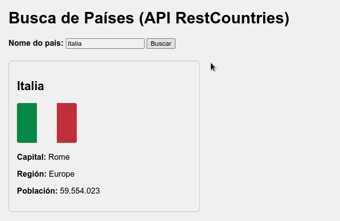
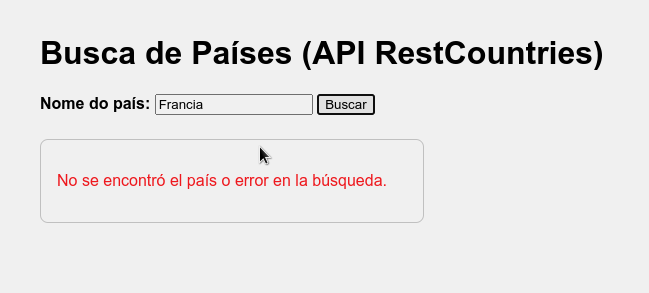
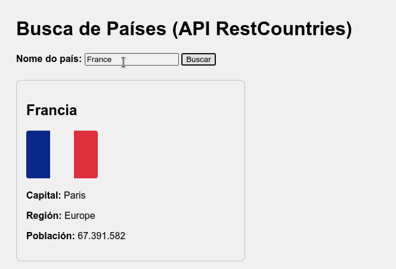
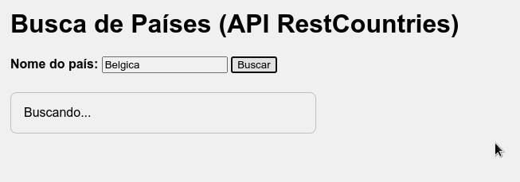

# Práctica: Busca de Países usando a API RestCountries

## Obxectivo
Crear unha aplicación web sinxela que permita buscar información sobre calquera país utilizando a [API pública de RestCountries](https://restcountries.com/), facendo uso de JavaScript moderno e da función `fetch` para acceder a datos externos.

---

## Parte 1: O ficheiro HTML

O profesorado entregaravos o seguinte ficheiro `index.html`, que inclúe a estrutura da páxina, os estilos e un campo para escribir o nome dun país:

```html
<!DOCTYPE html>
<html lang="es">
<head>
  <meta charset="UTF-8">
  <title>Búsqueda de Países - RestCountries API</title>
  <style>
    body { font-family: Arial, sans-serif; padding: 2rem; }
    #result { margin-top: 1.5rem; border: 1px solid #ccc; border-radius: 8px; padding: 1rem; width: 350px; }
    img { max-width: 120px; border-radius: 4px; }
    label { font-weight: bold; }
  </style>
</head>
<body>
  <h1>Búsqueda de Países (API RestCountries)</h1>
  <label for="country">Nombre del país:</label>
  <input type="text" id="country" placeholder="Ej: Portugal">
  <button onclick="buscarPais()">Buscar</button>

  <div id="result"></div>

  <script src="app.js"></script>
</body>
</html>
```

## Parte 2: O ficheiro JavaScript (app.js)

Debes crear o ficheiro `app.js` co código necesario para que, ao premer o botón "Buscar", se realice unha consulta á API RestCountries e se mostre a información do país buscado.


## Requisitos e pasos detallados

1. **Captura do nome do país**
   - Cando se prema o botón, le o valor introducido polo usuario no campo de texto (input con id `"country"`).
   - Comproba que o usuario escribiu algo. Se está baleiro, mostra unha mensaxe de erro.

2. **Consulta á API RestCountries**
   - Usa a función `fetch` para consultar a seguinte URL:
     ```
     https://restcountries.com/v3.1/name/NOME_DO_PAIS?fields=name,translations,capital,region,population,flags
     ```
     Onde `NOME_DO_PAIS` debe ser substituído polo nome introducido polo usuario (usa `encodeURIComponent` para asegurar que é válido en URL).
   - Esta consulta devolve un array cos países que coinciden coa busca.

3. **Tratamento da resposta**
   - Se a resposta é correcta, colle o primeiro elemento do array devolto.
   - Mostra no div con id `"result"` a seguinte información:
     - Nome do país en **castelán** (`translations.spa.common`). Se non está dispoñible, usa o nome común (`name.common`).
     - Bandeira do país (`flags.svg`).
     - Capital (`capital[0]`). Se non existe, indica "Desconocida".
     - Rexión (`region`).
     - Poboación (`population`) con formato de miles (usa `.toLocaleString()`).

4. **Xestión de erros**
   - Se a consulta falla ou o país non existe, mostra unha mensaxe de erro axeitada.


## Guía paso a paso para desenvolver o JS

1. **Definir a función buscarPais**
   - Esta función debe estar definida no ficheiro `app.js` para que poida ser chamada dende o botón do HTML.
   - Dentro desta función, obtén o valor do input co método `document.getElementById("country").value`.

2. **Validar a entrada**
   - Se o campo está baleiro, modifica o contido do div `"result"` para mostrar unha mensaxe de aviso e **non sigas executando a función**.

3. **Construír a URL para fetch**
   - Usa a función `encodeURIComponent()` para asegurar que o nome do país está correctamente formateado na URL.
   - Exemplo:
     ```javascript
     let url = `https://restcountries.com/v3.1/name/${encodeURIComponent(nombre)}?fields=name,translations,capital,region,population,flags`;
     ```

4. **Chamar a fetch e tratar a resposta**
   - Usa `fetch(url)`.
   - Comproba se a resposta é correcta (`response.ok`).
   - Se non é correcta, lanza un erro e xestiona no bloque `.catch()`.

5. **Extraer e mostrar a información**
   - No bloque `.then()`, accede ao primeiro elemento do array.
   - Saca os datos e compón unha cadea HTML co resultado.
   - Modifica o contido do div `"result"` para mostrar os datos.

6. **Manejo de erros**
   - No bloque `.catch()`, mostra unha mensaxe de erro no div `"result"`.

## Resultado esperados.







