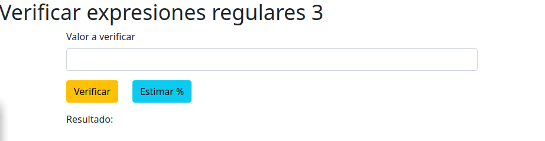
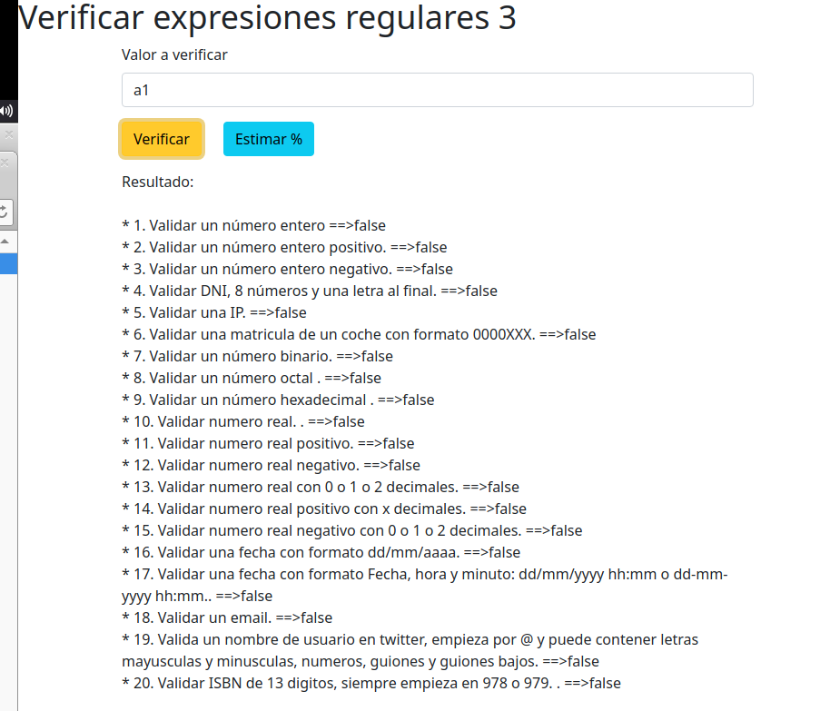

# DWCC05-01 - Expresiones regulares 


 Índice:

 * [Enunciado](#enunciado)
 * [Interface](#Interface)
 * [Eventos](#Eventos)
 * [Fecha limite de entrega](#fecha-limite-de-entrega)
  


# Enunciado
Escriba un programa que valide una cadena de texto segun un conjunto de patrones defenidos y que conste:

- Un formulario en cual se indroduce la cadena de texto  (letras o números). 


- Una sección en la cual se muestre si cumple o no la expresión regular:

 En la sección de resultados se indica si la cadena cumple o no los siguientes patrones: 

1.  Validar un número entero.
2.  Validar un número entero positivo.
3.  Validar un número entero negativo.
4.  Validar DNI, 8 números y una letra al final.
5.  Validar una IP.
6.  Validar una matricula de un coche con formato 0000XXX
7.  Validar un número binario.
8.  Validar un número octal.
9.  Validar un número hexadecimal.
10.  Validar numero real.
11.  Validar numero real positivo.
12.  Validar numero real negativo.
13.  Validar numero real con  0 o 1 o 2 decimales.
14.  Validar numero real positivo  con 0 o 1 o 2 decimales.
15.  Validar numero real negativo  con 0 o 1 o 2 decimales.
16.  Validar una fecha con formato dd/mm/aaaa o dd-mm-yyyy.
17. Validar una fecha con formato  Fecha, hora y minuto: dd/mm/yyyy hh:mm o dd-mm-yyyy hh:mm.
18.  Validar un email.
19.  Valida un nombre de usuario en twitter, empieza por @ y puede contener letras mayusculas y minusculas, numeros y guiones bajos.
20.  Validar ISBN de 13 digitos, siempre empieza en 978 o 979.

# Interface
Deberas crear una interface similar a la de la imagen.



Al pulsar sobre el botón verificar, éste realizará la prueba del valor del formulario con las expresionres regulares definidas. Finalmente mostrará en la parte inferior el resultado. 



# Eventos
Deberás asociar los eventos a los botones empleando addEventListener. Las funciones que invocarán cada botón son:

* **Verificar**, llamará  a  *eventoVerificar()* . 


* **Estimar %**, llamará a *estimar()* .

# Código fuente base
Se proporcionan los siguientes ficheros:


* modulo.js : No tienes que editar nada en ese fichero.


* index.html : Interface plantilla desde el cual debes partir


* index.js: Tienes que editar las zonas etiquetas con el comentario  `//TODO` , estas son:
  * `function eventoVerificar()`, tienes que completar la función recuperando el valor del input. 
  * `function validarResultado(input) ` , tienes que incorporar la lógica de las diferentes expresiones regulares. Para ello debes tener en cuenta las siguientes cuestiones: 


 1. Debes añadir el resultado de realizar el test de la expresión regular en el array resultado. Si no realizas esto correctamente la práctica se considera incorrecta. 

 2. Debes añadir en el mismo orden los test de las expresiones regulares según el enunciado. Si no realizas esto correctamente la práctica se considera incorrecta.        
 3. Fíjate en el ejemplo. Puedes observar como se añaden las  expresiones regulares. 
 4. Si no te sale una expresión regular puedes añadir un null en el array resultado en la posición que le corresponde. 
 5. El array 'resultado' se emplea para validar tus expresiones regulares con el banco de pruebas. 
      

  
  * `vincular eventos`, debes añadir los escuchadores en las zonas indicadas en el código fuente, como puedes ver en estre fragmento.


      ```js
      //Engadir o evento ao botón validar
      //TODO 


      //Engadir o evento ao botón estimar
      //TODO 

      ```

# Fecha limite de entrega
Se podrá entregar la práctica entre el 17 de febrero a las 0:00 y el 23 de Febrero a las 15:00. 

# Criterios de puntuación.
Cada expresión regular realizada correctamente se puntua con 0,5 puntos. Previamente es necesario asociar correctamente los eventos y desarrollar la lógica del programa. La puntuación máxima que se puede alcanzar es de 10 puntos (0,5 puntos * 20 expresiones regulares).

# Testing de la aplicación 
Puedes verificar el funcionamiento de la aplicación una vez desarrollado el código correctamente al pulsar el botón  `Estimar %` este botón realizará un banco de pruebas de las expresiones regulares definidas. 

Fijate por la consola, te mostrará información de los errores y verificación de las expresiones regulares. También te mostrará en un alert la nota estimada que tendrías. 


