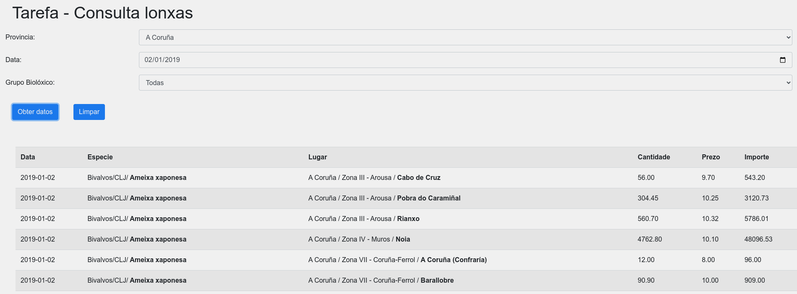
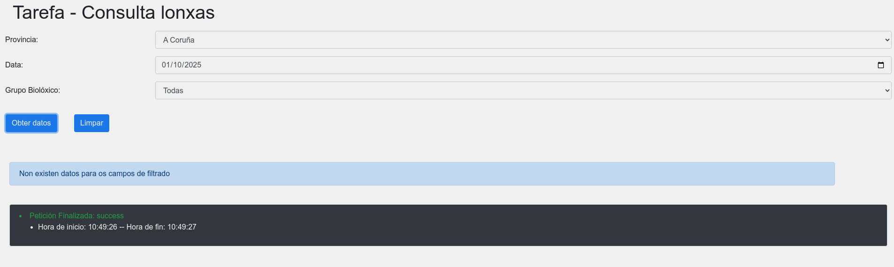
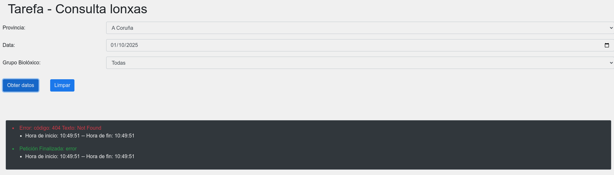

**Tarefa: Desenvolvemento da interacción no front-end para consultar lonxas**

O obxectivo desta tarefa é que desenvolvas a parte de JavaScript dun sistema web que permita consultar datos sobre lonxas, mediante o uso de filtros. O sistema debe permitir ao usuario seleccionar parámetros de consulta (provincia, data e grupo biolóxico) e enviar eses datos ao servidor para obter os resultados.

### Descrición do sistema:
O sistema ten un formulario con tres campos que permiten ao usuario filtrar os datos:
- **Provincia**: Un `select` con as opcións de provincias dispoñibles: A Coruña, Lugo, Ourense, Pontevedra e "Todas" para non filtrar por provincia.
- **Data**: Un campo de entrada de tipo `date` para que o usuario elixa unha data.
- **Grupo Biolóxico**: Un `select` con varias opcións para filtrar os datos por grupo biolóxico (e.g., "Peixes", "Crustáceos", etc.).

O usuario pode seleccionar unha combinación de filtros e facer clic en "Obter datos" para realizar a consulta. O sistema debe mostrar un **spinner de carga** mentres se procesan os datos e despois mostrar os resultados nunha táboa.

### Requisitos específicos:
1. **Interacción do botón "Obter datos"**:
    - Ao facer clic no botón **"Obter datos"**, debes capturar os valores dos campos do formulario (`_provincia`, `_data`, `_grupobiologico`).
    - Debes enviar unha petición ao servidor usando o método **`GET`** para solicitar os datos filtrados. A petición debe incluír os datos do formulario en formato **JSON** no corpo da petición.

2. **Petición ao servidor**:
    - A petición debe ser feita utilizando o método **`fetch`**.
    - O corpo da petición debe ser un obxecto JSON que inclúa os seguintes campos:
      - **_provincia**: valor seleccionado no campo de provincia.
      - **_data**: valor seleccionado no campo de data.
      - **_grupobiologico**: valor seleccionado no campo de grupo biolóxico.
    - Debes enviar os datos como un corpo JSON utilizando `JSON.stringify()`.

3. **Xestión da resposta do servidor**:
    - A resposta do servidor debe ser procesada como **JSON**.
    - Se o servidor responde con datos, debes mostrar os resultados nunha táboa HTML.
    - Se non hai resultados, deberás mostrar un mensaje indicando que non existen datos para os filtros seleccionados.
    - Se a petición falla (erro de rede, erro no servidor, etc.), deberás mostrar unha alerta co erro correspondente.

4. **Spinner de carga**:
    - Mentres se está procesando a petición, debe aparecer un **spinner de carga**. Unha vez que a petición termine, o spinner debe desaparecer.

5. **Mostrar os resultados na táboa**:
    - Os resultados deben ser mostrados nunha táboa que contén as seguintes columnas:
      - **Data**
      - **Especie** (incluíndo grupo biolóxico e fao)
      - **Lugar** (provincia, zona, lonxa)
      - **Cantidad**
      - **Prezo**
      - **Importe**

6. **Funcionalidade do botón "Limpar"**:
    - O botón **"Limpar"** debe restablecer os resultados da táboa e ocultar calquera mensaxe de erro ou éxito.

### Detalles técnicos:
1. **Uso de `fetch`**:
    - Deberás usar `fetch` para realizar a petición ao servidor. A petición debe ser feita ao arquivo `filtro.php` (simulado no exemplo) e usar o método `GET` con un corpo JSON.
    - A resposta do servidor será un obxecto JSON que deberás procesar e mostrar na páxina.

2. **Xestión de erros**:
    - Debes capturar os erros na petición e mostrar un mensaxe de erro en caso de que algo vaia mal. Se a resposta do servidor non for correcta, deberás xestionar o erro apropiadamente.

3. **Mostrar os datos**:
    - A táboa de resultados debe ser creada dinámicamente utilizando JavaScript.
    - O formato de cada fila na táboa debe ser:  
      `Data | Especie | Lugar | Cantidade | Prezo | Importe`.

4. **Deseño**:
    - Non é necesario que modifiques o deseño da páxina, pero debes asegurarte de que os resultados se amosen correctamente na táboa.
    - O **spinner de carga** debe estar oculto ao principio e só mostrarse cando se faga a petición.

## Funcións que debes implementar:

### 1. Configuración dos eventos (1 pto)

O primeiro paso na implementación do sistema é asociar eventos aos elementos HTML relevantes. Usamos a función `addEventListener` para conectar os botones "Obter datos" e "Limpar" a funcións que se executarán cando se fagan clics neles. Ao clicar no botón "Obter datos", chamamos a función que solicitará os datos ao servidor, e ao clicar no botón "Limpar", borramos os resultados e calquera mensaxe adicional da páxina.

### 2. Solicitar os datos ao servidor (3 ptos)

A función principal de interacción con o servidor é responsable de realizar a petición para obter datos filtrados. Primeiro, a función captura os valores introducidos polo usuario no formulario (provincia, data, grupo biolóxico). A continuación, se constrúe a URL para a petición utilizando os parámetros seleccionados.

Usamos o método `fetch` para enviar unha petición HTTP ao servidor, indicando que queremos enviar os datos en formato JSON. O corpo da petición contén un obxecto que inclúe os valores capturados do formulario.

Unha vez enviada a petición, a función espera a resposta do servidor. Se a resposta contén datos, estos se procesan e amósanse na páxina. Se non se reciben datos, mostrámoslle ao usuario un mensaxe indicándolle que non existen resultados para os filtros seleccionados.

A función tamén está configurada para manexar erros. Se ocorre algún problema ao enviar ou recibir a petición, a función xestiona o erro e amosa un mensaxe adecuado ao usuario.

Finalmente, a función tamén se asegura de ocultar o spinner de carga e amosar información adicional como a hora de inicio e fin da petición.

### 3. Xestionar erros (2 ptos)

A función encargada de xestionar os erros de comunicación ou procesamento das peticións simplemente mostra unha alerta co erro detectado. Esta é unha maneira sinxela de informar ao usuario que ocorreu un problema durante o proceso.

### 4. Mostrar os resultados na táboa (2 ptos)

Unha vez que a resposta do servidor é procesada e os datos están dispoñibles, a función responsable de mostrar os resultados constrúe dinámicamente unha táboa HTML. Cada fila da táboa corresponde a un dos resultados que se devolve desde o servidor.

Os resultados son mostrados en varias columnas que inclúen información como a data, a especie, o lugar, a cantidade, o prezo e o importe. Cada fila é creada utilizando un modelo predefinido e inserida na táboa da páxina.

### 5. Limpar os resultados (1 pto)

A función de limpar simplemente elimina todos os datos previamente mostrados na páxina. Isto inclúe tanto os resultados na táboa como calquera mensaxe adicional que se amosara ao usuario. A limpeza da páxina ocorre cada vez que o usuario fai clic no botón "Limpar", asegurándose de que a pantalla quede lista para novas consultas.

### 6. Mostrar información adicional sobre a petición (1 pto)

Ao finalizar a petición ao servidor, a función de mostrar información adicional amosa a hora de inicio e fin do proceso. Isto proporciona ao usuario información útil sobre o tempo que levou procesar a súa solicitude. Esta función tamén se chama cando a petición se completa, e o tempo de inicio e fin é mostrado na páxina.
  
--

## Capturas da interface co resultado esperado
### Retorno dos resultados 

### Petición sen resultados.

### Petición con erro.
Podese simular renomeando temporalmente o ficheiro filtro.php.

---

**NOTA IMPORTANTE:**
- A implementación de JavaScript debe ser feita **sen utilizar bibliotecas externas como jQuery**. Todo debe facerse utilizando JavaScript nativo.
- A resposta do servidor será simulada cun ficheiro PHP (`filtro.php`), pero no teu código non necesitarás interactuar directamente co PHP, só cos datos JSON que recibe a función de `fetch`.

---

### Recursos adicionais:
- [Documentación de `fetch`](https://developer.mozilla.org/es/docs/Web/API/Fetch_API/Using_Fetch)
- [JSON.stringify() en MDN](https://developer.mozilla.org/es/docs/Web/JavaScript/Referencia/Objetos_globales/JSON/stringify)
