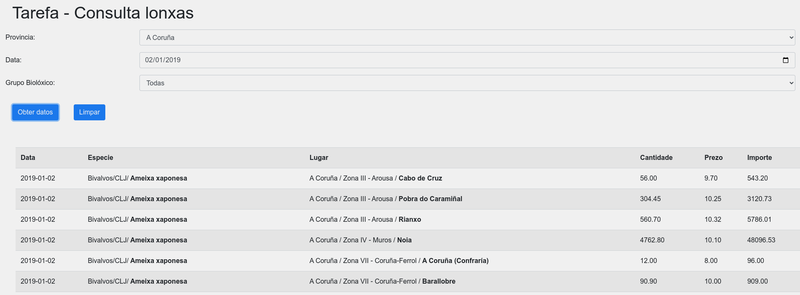
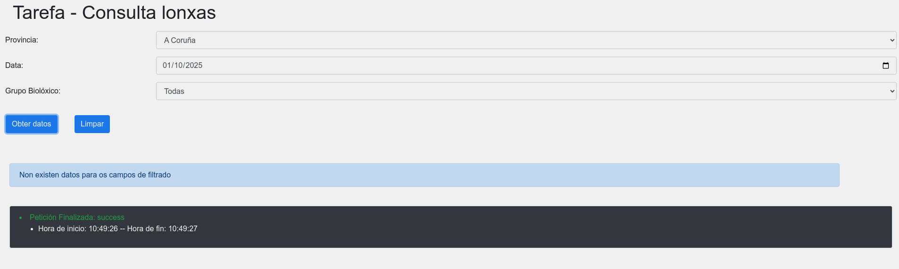
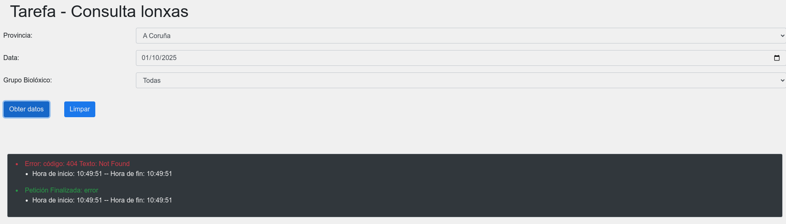

# Enunciado. 


## 1. `solicitarDatos()`
Esta función é a que se invoca cando o usuario fai clic no botón **"Obter datos"**. O seu obxectivo principal é facer unha solicitude ao servidor (usando `$.ajax()`) para obter os datos filtrados segundo os parámetros seleccionados polo usuario nos formularios (provincia, data e grupo biolóxico).

**Pasos clave:**
- Podes consultar datos da pesca de cada lonxa no ano 2019. 
- Antes de realizar a solicitude, oculta o `spinner` (indicador de carga) e chama á función `limpar()` para borrar os resultados e os erros anteriores.
- Recóllense os valores seleccionados polo usuario nas caixas de selección e no campo de data.
- Realízase unha solicitude AJAX de tipo `POST` a un arquivo PHP (`filtro.php`), pasando os parámetros como datos de entrada.
- Se a solicitude é exitosa, invócase a función `mostrarDatos()` para mostrar os resultados.
- Se hai un erro na solicitude, invócase a función `mostrarErro()` para xestionar os erros.
- Finalmente, usa a función `complete()` para ocultar o `spinner` e mostrar un resumo do tempo de execución da solicitude.

## 2. `limpar()`
Esta función elimínase ou limpa os datos previamente mostrados na páxina, tanto os resultados da consulta como as posibles mensaxes de erro. 

**Pasos clave:**
- Establece o contido da `div` onde se mostran os resultados (`#resultado`) e da `div` onde se mostran os erros (`#info`) como cadeas de texto vacías. Deste xeito, borra todo o contido da táboa e os erros antes de mostrar novos resultados ou mensaxes de erro.

## 3. `mostrarDatos(datos)`
Esta función é responsable de mostrar os datos obtidos na solicitude AJAX. Recibe un parámetro chamado `datos`, que é un array de obxectos JSON que representan as lonxas filtradas.

**Pasos clave:**
- Primeiro, define a estrutura inicial da táboa (`table`) que conterá os resultados, con columnas como "Data", "Especie", "Lugar", "Cantidade", "Prezo" e "Importe".
- A continuación, percorre o array `datos` usando o método `forEach()` e chama á función `filaTabla()` para crear unha fila para cada obxecto de datos.
- Finalmente, engádese a táboa construída á `div` con id `#resultado`.

## 4. `filaTabla(fila)`
Esta función crea unha fila de táboa HTML a partir dun obxecto que representa unha lonxa. Recibe un parámetro chamado `fila`, que é un obxecto que contén os datos de cada lonxa.

**Pasos clave:**
- A función constrúe unha cadea de texto que representa unha fila de táboa con varias columnas. Cada columna está asociada aos campos do obxecto `fila`, como a data, o grupo biolóxico, a especie, a provincia, o lugar e os valores de cantidade, prezo e importe.
- Retorna a fila HTML para que sexa engadida á táboa.

## 5. `mostrarErro(data)`
Esta función é invocada cando ocorre un erro durante a solicitude AJAX. No código actual, só mostra un alerta simple indicando que ocorreu un erro, pero non está completamente implementada para ofrecer detalles específicos sobre o erro.

**Pasos clave:**
- A función só mostra unha alerta con o texto `"Erro"`. Neste caso, a implementación está algo incompleta, xa que sería útil mostrar detalles do erro (como o status da solicitude ou unha mensaxe de erro máis específica).

## 6. `mostrarInfoDatas(d1, d2)`
Esta función recibe dúas instancias de `Date` (representando o inicio e o final da solicitude) e crea un resumo do tempo de execución da petición AJAX.

**Pasos clave:**
- A función constrúe unha lista (`ul`) con unha liña (`li`) que amosa as horas e minutos de inicio e fin da solicitude.
- A súa finalidade é mostrar de forma clara o tempo que levou realizar a petición.
- Unha posible solución pode ser algo como o seguinte: 
```js
        let saida=`
                    <ul>
                         <li> Hora de inicio: ${d1.getHours()}:${d1.getMinutes()}:${d1.getSeconds()} -- Hora de fin:   ${d2.getHours()}:${d2.getMinutes()}:${d2.getSeconds()}</li> 
                    </ul> `;

```

---

## Resumo xeral:
- **`solicitarDatos()`**: Xestiona a petición AJAX para obter os datos filtrados. (3 ptos)
- **`limpar()`**: Limpa os resultados e os erros na páxina. (1 pto)
- **`mostrarDatos()`**: Mostra os resultados nunha táboa HTML. (3 ptos)
- **`mostrarErro()`**: Xestiona os erros da solicitude AJAX. (2 pto)
- **`mostrarInfoDatas()`**: Amosa un resumo do tempo de execución da petición.(1 pto)

 ## Capturas da interface co resultado esperado
 ### Retorno dos resultados 
 
 
 ### Petición sen resultados.
 
 
 ### Petición con erro.
 Podese simular renomeando temporalmente o ficheiro filtro.php.
 
 